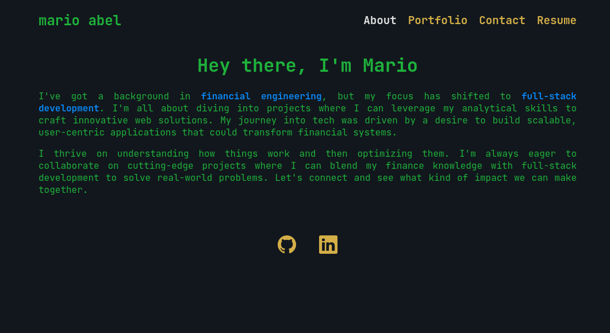

# Personal Portfolio

- [Link to portfolio](https://marioxabel-portfolio.netlify.app/)

## Description
A personal portfolio website built using modern web development technologies. This website showcases my work, skills, and background as a front-end developer.

## Table of Contents
- [Installation](#installation)
- [Usage](#usage)
- [Technologies Used](#technologies-used)
- [How to Contribute](#how-to-contribute)
- [Questions](#questions)
- [Authors and acknowledgment](#authors-and-acknowledgment)
- [License](#license)

## Installation
run npm -i to install required packages 

## Usage
run npm start to run the app

features:
- Responsive design (mobile-first approach)
- Dynamic hamburger menu
- Sectioned layout for smooth navigation
- Dark theme inspired by terminal aesthetics
- Accessible navigation for all screen sizes
- Fast load time and optimized assets
- Contact form

## Technologies Used
- HTML5
- CSS3
- JavaScript
- React
- React Router
- Git
- Netlify deploy

## How to Contribute
To contribute create a branch and open a pull request commenting the changes you want to implement

## Questions
You can reach me for questions at [github profile](https://github.com/marioxabel)

## Authors and acknowledgment
- Author: [Mario](https://github.com/marioxabel)
- This was a challenge for the [Tecnológico de Monterrey Coding Boot Camp](https://bootcamp.tec.mx/coding/)

## License
Distributed under the MIT License. [Click to see the full MIT license](https://choosealicense.com/licenses/MIT/).
